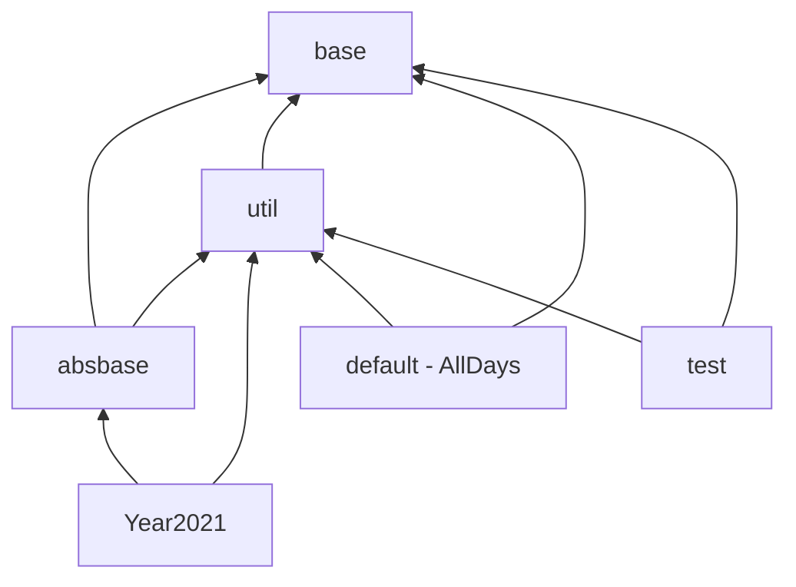

## Index

- [Structure](#structure)
- [Day 1 - 25](#day-1---25)
- [DayX](#dayx)
  - [Command line arguments](#command-line-arguments)
  - [Reading the input file](#reading-the-input-file)
  - [Runtimes](#runtimes)
  - [Printing](#printing)
- [Result](#result)
- [Classes](#classes)
- [Test](#test)

<br />

## Structure

The project uses both named and the default package. The `default` package is being used by one "runnable" class `AllDays` to enable running it with

```
C:\Users\Me\advent-of-code> java -cp run AllDays
```

Everything else is placed in named packages:

| package    | description                                                        | contains     |
|:-----------|:-------------------------------------------------------------------|:-------------|
| `base`     | Interfaces.                                                        | AllDaysI <br /> DayI <br /> ResultI <br /> StateI <br /> Status |
| `absbase`  | One abstract class `DayX` which all Day implementations `extends`. | DayX         |
| `util`     | Utility classes. Mostly static implementations.                    | Classes <br /> CommandLineOptions <br /> ConvertAscII <br /> DataReader <br /> FileName <br /> Printers <br /> Result <br /> State <br /> Timers |
| `Year2021` | All the Day implementations for 2021.                              | Day1 - Day25 |
| `test`     | One test: `DaysTest`.                                              | DaysTest     |

<br />

The structure enables this non-cyclic package dependency:


<br />

## Day 1 - 25

All Day implementations must reside in a package that determines the year. It's prefixed "Year", so 2021 solutions resides in the pacakge "Year2021". They must each **`extends DayX`** and contain the following:

 - A main method that instatiates the Day with the arguments. Then calling `doIt()`. For example:

   `new Day2(args).doIt();`

 - A constructor that ensures handling of the arguments, by passing them to the DayX constructor:

   `super(args);`

 - An implementation for the method:

   `public Result solve(String input)`

Optionally

 - Implementating

   `public Result solvePart2(String input)`.

   The result for part 2 is implemented by the abstract class `DayX` and set to a dummy default result.

 - Instantiating a `Map` of alternative implementations that will be run in a loop `<INTEGER>` times when using the `-alt <INTEGER>` arguments. There are two maps, `this.alternatives` for part 1 solutions and `this.alternatives2` for part 2. The keys are `String` which are the names of the alternatives, and the values are `Function<String, Result>` taking in input and returning a `Result`. For example:

   ```
   this.alternatives =
      Map.of("Fast", (i) -> solvePart1Fast(i)},
             "Slow", (i) -> solvePart1Slow(i));
   ```

If using either one of `GraysPile.sh` or `GraysPile.cmd` to compile the source, any new packages must be added to the script.

<br />

## DayX

This abstract class holds all common instance variables and handles or redirects:
- Command line arguments.
- Reading the input file.
- Calling the solvers and storing the runtimes.
- Running alternative versions.
- Printing error messages or the results.

### Command line arguments

The `CommandLineOptions` is quite simple. It takes in each argument and changes the corresponding settings. It returns a `FileName.builder`, which holds the components to the path to the input file. Calling `build()` on the builder sets the path.

For `AllDays`, it only handles arguments directly related to `AllDays` while collecting the rest. Those are to be passed into every Day constructor once the `AllDays` run.

### Reading the input file

`DataReader` just reads the file, setting its content using a `Consumer` callback. It returns a `State`, which can be any of:

- `GOT_EXCEPTION`
- `NO_FILE_CONTENT`
- `FILE_OK`

The `DataReader` is also used to read an ascII file returning a `Result`. This is used in the test only.

### Runtimes

Runtimes are handled by `Timers`. Passing in a `Function` and an `input`, it will run the `Function` on the input:

```
Timers.timeItResult((in) -> solve(in), input);
```

The timing uses `System.nanoTime()` before and after running the function.

Note that this meant as a rough estimate between for example 50 mili seconds or 2 seconds. It's not a benchmarking tool. 30-50 nanoseconds off isn't considered an issue for this rough estimate.

For why the `System.nanoTime()` isn't accurate, see [Nanotrusting the Nanotime](https://shipilev.net/blog/2014/nanotrusting-nanotime/). Proper benchmarking can be done using "Java Microbenchmark Harness".

### Printing

This takes in objects and prints their values according to hardcoded predefined formats. The only variable is the `PrintStream` which is static with the default value `System.out`. It can be changed to any other `PrintStream` which is done when using the `-o <FILE>` argument when running the program.

<br />

## Result

Results are composed of
- `long` for long values.
- `String` and a `String` array for ascII values
- `State`

The `State` defines the type of Result, which can be any of the `Status` enums:

- `NORMAL_LONG`
- `ASCII`
- `NO_RESULT`
- `FILE_OK`
- `NO_FILE`
- `NO_FILE_CONTENT`
- `GOT_EXCEPTION`

Exceptions will hold the actual exception in an `Exception` or a message `String` in case of a file error.

When `DayX` starts processing the Day, it will only call the solvers if the returned `State` from the DataReader is `FILE_OK`. Once the Day has run, the `State` is changed to either `NORMAL_LONG` or `ASCII`.

As previsouly mentioned, the part 2 implementation is optional. `DayX` will default to setting the Result for part 2 to `NO_RESULT`. This default can be overwritten by implementing a solver.

`Result` has four static initializers:
  - `createResult(long result)`
  - `createAscIIResult(String[] ascII)`
  - `createFileErrorResult(State state)`
  - `createDummyResult()`

For ascII results, the resulting ascII is attempted to be translated into letters using `ConvertAscII`. This will search for spaces in the lines of the ascII `String` array. If it finds a space, it will check is there's a space at the same index in all the other lines. Separating the partial strings in all lines, it uses a map of `String` arrays as a lookup table. For example:

```
 ##  ####
#  #    #
#      #
#     #
#  # #
 ##  ####
    ^ index 4
```

has such a line of spaces at index 4. It will look for an entry in the map using a `String` array of first all lines from index 0 to 4, and then from 5 to the end of the line. In this case finding both C and Z. However, it will not find the square `String` array for the sample input of Day 13 2021.

Calling `getPrintableResult()` on the `Result` will return either a `long` or the translated ascII `String` (or "---" is no translation is possible). Note that this method will return `0` even if there's no valid Result. Validity can be checked with `isValid()`.

<br />

## Classes

This is reponsible for finding year packages with the fixed name of `YearYYYY`, where YYYY are any 4 digits, preferably the year, so `Year2021` would be the package name for Day implmentations of the 2021 puzzles.

It will also find any `Day` implementations in a year package. `Day` implementations are expected to conform to the name of `DayZ`, where Z is a digit, so `Day7` would be the day implementation for the 7th day.

The idea is that calling `getYearPackagesOnClassPath()` will return a `Set` of `YearPackage`, that contains the name of the package, the type of file it's in and the path to the root of the package. In case of it being a `.jar` file, the root is the `.jar` file. It bases the search for year packages on the system set class path: `System.getProperty("java.class.path")`.

Using the `Set`, `Day` implementations can then be found by calling either:
- `classNamesAsStream(String packageName)`
- `classNamesAsStreamJar(String packageName, String asClassPath)`

If the `.class` files are not packaged into a `.jar` using `.getResourceAsStream​(String name)` will find every implementation in that package. However, this is not the case for a `.jar` file, which must be opened as a zipfile. In this case using `JarFile`.

Due to a bug, it's only possible to open a `.jar` files once! See [Jetty - java.lang.IllegalStateException: zip file closed](https://stackoverflow.com/questions/19123887/jetty-java-lang-illegalstateexception-zip-file-closed). This bug is unfortunately not localized to Jetty.

It's also not possible to use `.getResource(packageName)` with a package name being contained in a `.jar`. Java will find the package, but since Java locks the `.jar` file, it makes it impossible to later get a listing of the files contained. So the `.jar` files are instead opened once, and all it's content is cached and kept in a static map. When calling `classNamesAsStreamJar`, the `asClassPath`, that is the name or location of the `.jar`, is then used as a key into the map.

This class also instatiates a Day object with a call to `createClass(String className, String packageName, String[] dayArgs)`, for example:
```
Classes.createClass("Day7", "Year2021", new String[]{"-d", "challenge"});
```

### Test

When running the test using Maven, the class path is quite large. However, it contains the "run" directory. Since none of the `.jar` files are this packaged project, they are filtered out and the discovery of packages are all in the directory of a classpath on the file system, which happens to be just the "run" directory.

However, when running test *"Manually" on the command line* using:

```
C:\Users\Me\advent-of-code> java -jar libraries/junit-platform-console-standalone-1.8.2.jar --disable-ansi-colors --class-path run:libraries/gson-2.8.9.jar -c test.DaysTest
```

the `junit-platform-console-standalone-1.8.2.jar` is the entire classpath.

Discovering packages, calling `Classes.getYearPackagesOnClassPath()` (that only uses the system classpath) as done from `AllDays`, isn't feasible. Instead the calls are made to `Classes.getYearPackagesFile(String asClassPath)` in a loop of paths excluding `.jar` files. The filering can cause an empty result of classpaths, in which case a hardcoded path of "run" is used.